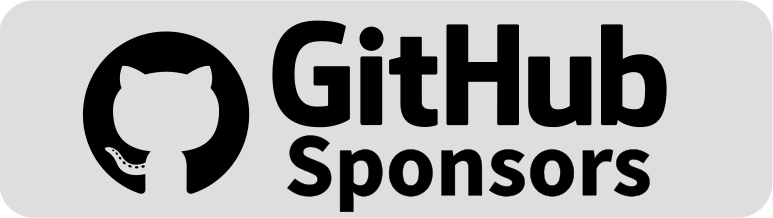

# Home Assistant Additional Icons

[](https://www.home-assistant.io/)
[](https://github.com/custom-components/hacs)
[](https://github.com/MattFryer/Hass-Custom-Icons/releases/latest)
[](https://github.com/MattFryer/Hass-Custom-Icons/blob/master/LICENSE)


[](http://isitmaintained.com/project/MattFryer/Hass-Custom-Icons "Average time to resolve an issue")


Additional icons for use in the Home Assistant UI. I initially created this component to add icons for self hosted services I use which weren't available in any other HA icon set. Additional icons have been added where the icons that are available were either out of date (i.e. when the branding had changed but the icon set hadn't been updated to reflect it) or where the available icons had issues (such as poor cropping making them look smaller than other icons in the dashboard).

Whilst this component and the icons within are intended for my own use, feel free to use them in your Home Assistant instance also.

## Adding More Icons
If you would like to add more icons, please [raise an issue](https://github.com/MattFryer/Hass-Custom-Icons/issues) in the Github repository and I'll consider adding. Alternatively, add the icons yourself and [raise a pull request](https://github.com/MattFryer/Hass-Custom-Icons/pulls).

If you just want to show your appreciation, you can sponsor the project or send a one off donation using the links below:

[](https://buymeacoffee.com/mattfryer)
[](https://github.com/sponsors/MattFryer)

## Installation
It is advised to install this Home Assistant plug-in via HACS (the Home Assistant Community Store). If you have HACS installed already you can click this button to quickly add this repository to HACS and open the page ready to install.

[](https://my.home-assistant.io/redirect/hacs_repository/?owner=MattFryer&repository=Hass-Custom-Icons&category=Dashboard) 

Alternatively, you can follow the below steps to add this repository to HACS manually as a custom repository and install the plug-in:
1. Ensure HACS is already installed on Home Assistant https://hacs.xyz/docs/use/
2. In Home Assistant, navigate to **HACS**.
3. Select the 3 dots icon in the top right and choose **Custom repositories**
4. Enter `https://github.com/MattFryer/Hass-Custom-Icons` as the repository and select the type of **Dashboard**. Click on **Add**.
5. **Custom Icons Pack** should now be shown just like any other HACS components when searching for it. Click on **Custom Icons Pack**, then in the bottom right click **DOWNLOAD** then in the popup window that opens click **DOWNLOAD** again.
6. Once download and installation is complete, confirm you wish to **RELOAD** the UI

### Optional - Sitewide availability
By default the icons can only be used inside Lovelace dashboards. To use the icons site wide, such as for custom sidebar links, add the following to the `frontend` section of your Home Assistant `configuration.yaml` file:

```yaml
frontend:
  extra_module_url:
    - /hacsfiles/hass-custom-icons/hass-custom-icons.js
```

> [!TIP]
> For the icons to be shown correctly, you may need to refresh your browser a couple of times after installation or updating the component. 

## Icons
Below are all of the currently available icons in this component and their codes to add them to your Home Assistant dashboards. The component supports browsing and searching for icons in the Home Assistant visual editor, just like when using the in-built Home Assistant MDI icons. Alternatively, you can enter the specific icon code (including the `cust:` prefix) when using the YAML code editor instead.

| Icon          | Code          |
| ------------- | ------------- |
|  | cust:aldi  |
|  | cust:alexa  |
|  | cust:alexa-plus  |
|  | cust:apple-tv  |
|  | cust:apple-tv-plus  |
|  | cust:audiobookshelf  |
|  | cust:b&q  |
|  | cust:bazarr  |
|  | cust:bbc-micro  |
|  | cust:bbc-sounds  |
|  | cust:bbc-sounds-alt  |
| | cust:bitwarden  |
| | cust:bookstack  |
|  | cust:calibre-web  |
|  | cust:disney-plus  |
|  | cust:draw-io  |
|  | cust:esphome  |
|  | cust:evri  |
|  | cust:extractor-hood  |
|  | cust:fileflows  |
|  | cust:firetv  |
|  | cust:fitbit  |
|  | cust:get-iplayer  |
|  | cust:gramps-web  |
|  | cust:hass  |
| | cust:hbo-go  |
| | cust:homepage  |
| | cust:honeywell  |
| | cust:honeywell-alt  |
| | cust:hp  |
|  | cust:influxdb  |
|  | cust:iplayer  |
|  | cust:iplayer-alt  |
|  | cust:it-tools  |
|  | cust:jellyseerr  |
|  | cust:jellystat  |
|  | cust:kasa-smart  |
|  | cust:layzspa |
|  | cust:layzspa-bubbles |
|  | cust:layzspa-heat  |
|  | cust:layzspa-pump  |
|  | cust:lg  |
|  | cust:lg-alt  |
|  | cust:lg-thinq  |
|  | cust:linkding  |
|  | cust:linktap  |
|  | cust:logitech  |
|  | cust:m&s  |
|  | cust:mariadb  |
|  | cust:mealie  |
|  | cust:micro-bit  |
|  | cust:micro-bit-alt  |
|  | cust:micro-bit-alt2  |
|  | cust:mqtt-explorer  |
|  | cust:music-assistant  |
|  | cust:network-ups-tools  |
|  | cust:nhs  |
|  | cust:ninja-air-fryer  |
|  | cust:node-red  |
|  | cust:ntfy  |
|  | cust:nuaire  |
|  | cust:octoprint  |
|  | cust:octoprint-alt  |
|  | cust:octopus-energy  |
|  | cust:ollama  |
|  | cust:omada  |
|  | cust:openai  |
|  | cust:paperless  |
|  | cust:peanut  |
|  | cust:piper  |
|  | cust:planka  |
|  | cust:readarr  |
|  | cust:resideo  |
|  | cust:resideo-alt  |
|  | cust:ring  |
|  | cust:romm  |
|  | cust:sainsburys  |
|  | cust:screwfix  |
|  | cust:sonoff  |
|  | cust:sonos  |
|  | cust:synology  |
|   | cust:synology-dsm  |
|  | cust:tado  |
|  | cust:tasmota  |
|  | cust:tesco  |
|  | cust:toolstation  |
|  | cust:tp-link  |
|  | cust:tree-christmas  |
|  | cust:vaultwarden  |
|  | cust:vscode  |
|  | cust:waitrose  |
|  | cust:watchtower  |
|  | cust:wemo  |
|  | cust:zigbee2mqtt  |
